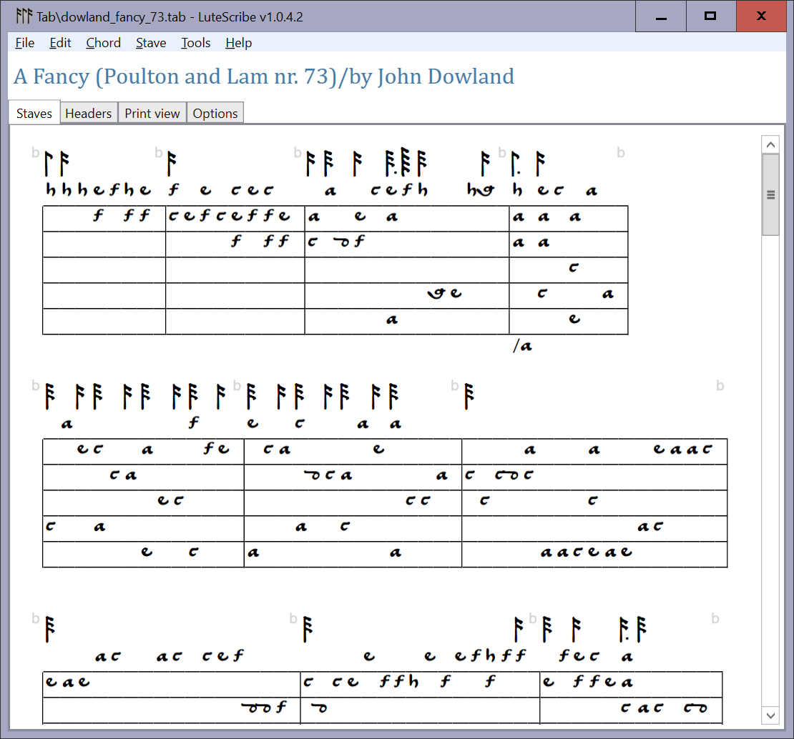

# LuteScribe

LuteScribe is a Windows application for viewing and editing musical tabulature for lutes and related historical instruments. It offers an editing window to view and edit your tabulature in a format that is easy to understand. It also shows the fully rendered output.

Behind the scenes, LuteScribe works closely with the TAB program to create attractive typeset output. All the formatting commands of TAB canbe used in your LuteScribe content.

LuteScribe can open tabulature written in the following formats: TAB,Fronimo (FT3, FT2), Fandango (JTZ, JTXML), and its own LSML format, based on XML.

You can preview your tabulature, or save as PDF or print it out.

# Screenshots

Print view showing typeset content:

Editor tab where you create the tabulature content:

## License

LuteScribe is released under the GNU Public License version 3. 

